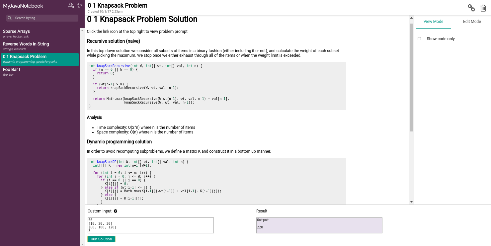

# MyJavaNotebook
An API useful for writing, testing, and sharing solutions to algorithm and data structure
problems from various sites such as LeetCode, HackerRank and GeeksForGeeks, all beneath a
nifty React JS front-end akin to Jupyter Notebook.

## Screenshots



## Getting Started

### Requirements
- JDK 1.8+
- Maven
- npm
- *nix system (Mac OS or Linux)

### Build
```
$ git clone https://github.com/furioustiles/myjavanotebook
$ cd myjavanotebook
$ mvn package
```

## Run
```
$ java -jar target/myjavanotebook-0.0.1.jar
```
The app should be accessible via http://localhost at port 8000.

### Upload example problems
Click the upload icon on the top left to import a problem. Example problems are located in the
"examples" directory. You can also create a new problem by clicking the plus icon on the top left.

### License
MIT
